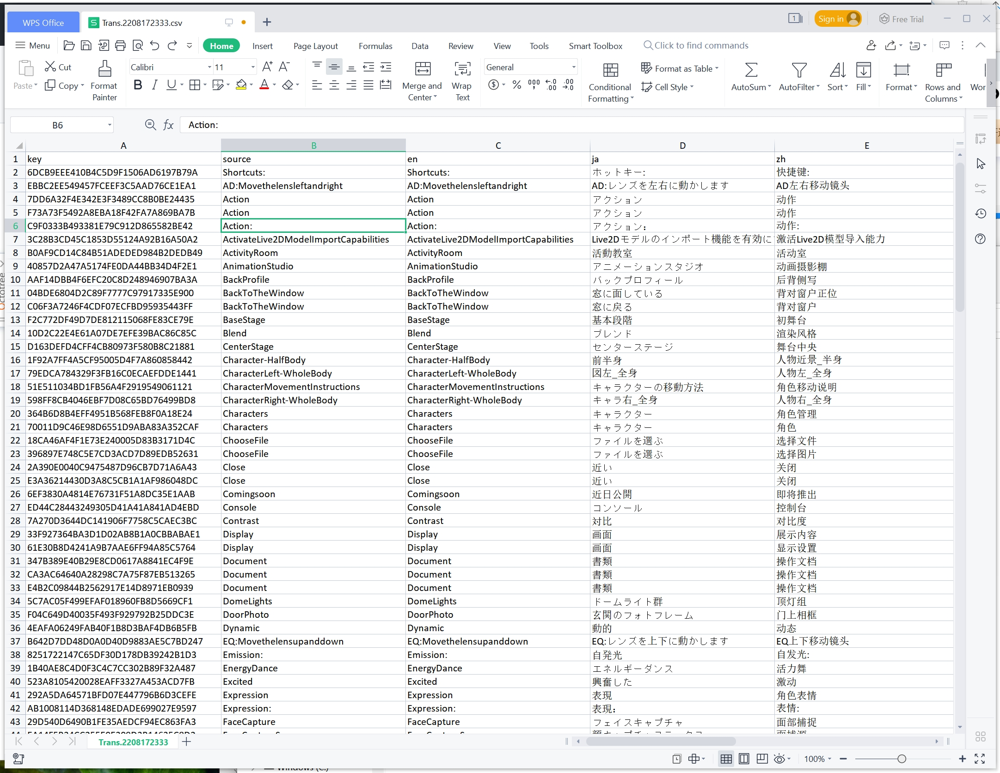

# UE-Localization-CSV
Automatically convert localization files under the ureanl project into CSV files, which is more convenient for proofreading and multi language translation

## how to use

Before use this tool, check you have nodejs environment, need nodejs >= 16. [Download here](https://nodejs.org/)

1. download this project

2. Execute command `npm install` in CMD

3. open `index.js` file, change relevant parameters

    - **ProjectPath**: Your unreal project root directory
    - **ExportLocalizationPath**: Directory of the exported file

4. Every Time to Export, Execute command `node index.js` in CMD